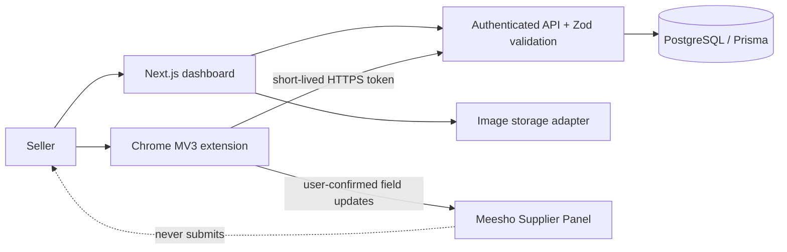

# ListingKing

Meesho-only smart listing workflow. ListingKing helps a seller capture a template from a Meesho catalog form, prepare several catalog items in a dashboard, then review-and-fill one item at a time through a Chrome extension. It never submits a Meesho catalog.

## Architecture



## Database outline

`User` owns `Template`, `SmartListing`, `AiGeneration`, `FillJob`, and `AuditLog`. A `Template` has versioned, independently mapped `TemplateField` rows. A `SmartListing` has ordered `SmartListingItem` records, each with price fields, SKU, images, AI history, and fill-job reports. Ownership indexes are defined in [schema.prisma](prisma/schema.prisma).

## API outline

| Endpoint | Purpose |
| --- | --- |
| `POST /api/auth/register` | Create password account (hashes server-side) |
| `POST /api/extension/token` | 15-minute extension access token |
| `GET/POST /api/templates` | List/capture user-owned templates |
| `GET/POST /api/smart-listings` | List/create resumable drafts |
| `POST /api/smart-listings/:id/generate` | Generate reviewable content drafts |
| `POST /api/smart-listings/:id/ready` | Validate content/prices and mark ready |
| `GET /api/extension/ready-listings` | Extension’s available work queue |
| `POST /api/fill-jobs` | Per-item, non-sensitive fill report |

Errors are structured as `code`, `message`, and (where relevant) `fieldErrors`.

## Extension structure

```text
extension/
  manifest.json       # MV3 + two Meesho supplier hosts only
  content.js          # safe capture, dry run, confirm-before-fill, stop control
  background.js       # non-sensitive audit storage
  popup.html/js       # dashboard/token connection
```

## Milestones

1. **Included:** dashboard flow, Prisma schema, credential auth, template capture endpoint, draft creation, seller price validation, local safe content fallback, SKU generation, MV3 safety controls.
2. **Next:** production S3 storage adapter, drag/drop image pairing and checksum validation, Gemini server adapter with cache/retries, server-provided field payloads in extension.
3. **Before launch:** route rate limits, encrypted refresh-token rotation, integration tests with a mocked Meesho fixture, remapping UI, operational monitoring, security review.

## Run locally

1. Copy `.env.example` to `.env`; add your PostgreSQL connection string locally. Do **not** commit it or put it in extension files.
2. Run `pnpm install`, `pnpm db:generate`, `pnpm db:migrate --name init`, optionally `pnpm db:seed`, then `pnpm dev`.
3. Load the [extension folder](extension) as an unpacked extension in Chrome. Use only a test or seller-authorized Meesho catalog form.

The current UI uses sensible in-browser demo state so the five-step flow can be inspected before authentication is wired into the screens. API routes are ready to receive authenticated persistent data once the sign-in screens are added.
